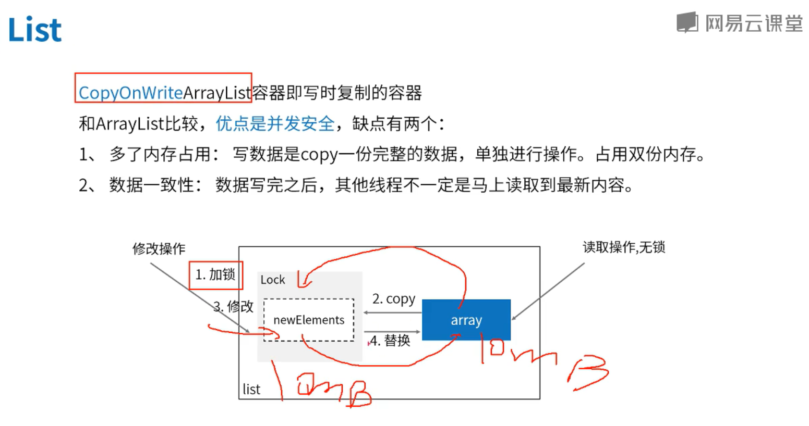

 # ArrayList

 1. transient Object[] elementData;

 2. array grow 使用 Array.copyOf 生成新的数组

 3. 线程不安全,没有用到任何的锁
 
 ```java
 ArrayList arrayList = new ArrayList();
 private static final int DEFAULT_CAPACITY = 10;
 private static final Object[] EMPTY_ELEMENTDATA = new Object[0];
 private static final Object[] DEFAULTCAPACITY_EMPTY_ELEMENTDATA = new Object[0];
 transient Object[] elementData;
 private int size;
 private static final int MAX_ARRAY_SIZE = 2147483639;
```

# CopyOnWriteArrayList
 CopyOnWrite 写时复制的容器,副本写完copy回去

 1. transient volatile Object[] array;

 2. 线程安全 add remove 使用 ReentrantLock  or  synchronized(Object)

 3. newElements = Arrays.copyOf(es, len + 1);
    System.arraycopy(es, index, newElements, index  + 1, numMoved);
    CopyOnWriteArrayList<String> copyOnWriteArrayList = new CopyOnWriteArrayList<>();
