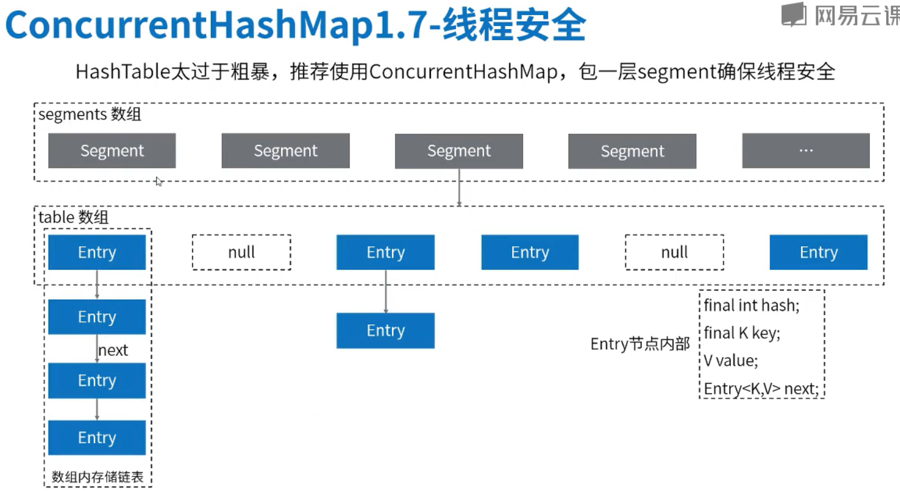
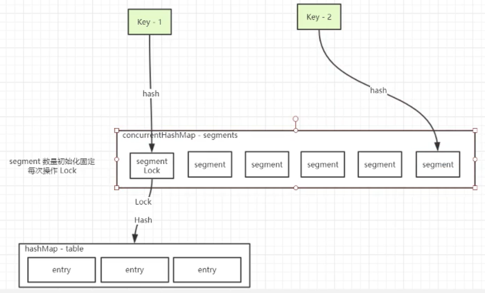
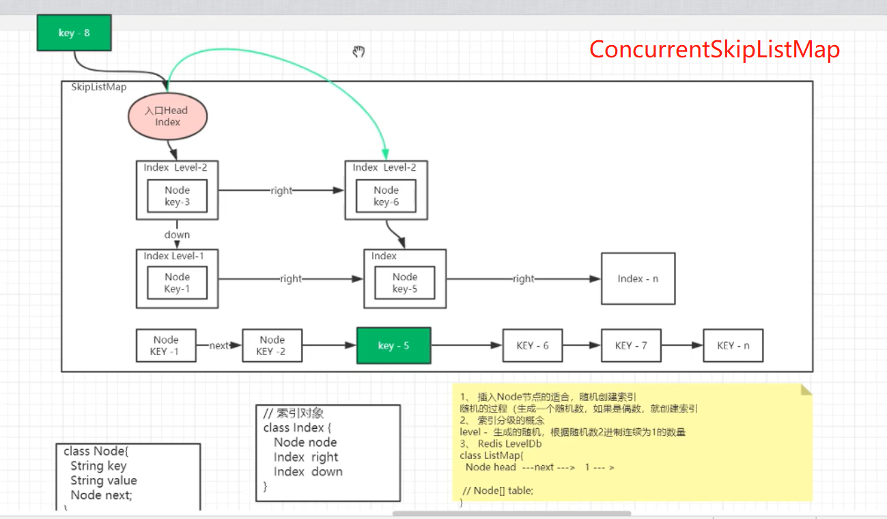

#推理HashMap的实现

## 1. 数据要存储
  
  涉及数据结构: 数组、链表、栈、树、队列
  
## 2. 数组的插入和查找

  顺序查找：插入时按先后顺序插入，查找时轮询扫描进行对比。
  
  二分查找： 插入时进行排序；查找时将n个元素分成大致相等的两部分，减少复杂度。
  
  分块查找： 分块查找时二分查找和顺序查找的一种改进。
  
  哈希表：对元素的关键信息进行hash计算，求出下标后直接插入或查找。常用的实现时除留余数法。

## JDK 1.7 HashMap
HashMap 数组 
## JDK 1.8 HashMap
HashMap 数组(>=64红黑树)
数组 长度超过(>)8但小于(<)64 数组 进行resize操作
数组 长度>=64 treeifyBin 数组 转为红黑树

--> 如何resize? 如何treeifyBin?

## JDK1.7 ConcurrentHashMap
 

//
use segment数组 0 as prototype

// 或者叫分段锁
segment is lock,array in lock

 不同segment并行操作,相同segment同步操作

 segment不会扩容,默认就是这几个锁,锁不会增长.



## JDK1.8 ConcurrentHashMap

1.不使用segment作为lock
 而是Synchronized锁 数组 的头部,数组扩容,锁也就同时扩容.
 既线程安全又提供了更大的并发量.
 
2. 如果冲突的才会同步
  如果不冲突则是CAS无锁操作
  
 


## ConcurrentSkipListMap
 
* 特点:基于有序链表实现,无锁实现;value不能为空;

 层级越高跳跃性越大,数据越少,查询理论变快.
 
 * 新的node是否抽出来作为index,随机决定;
 
 index对应的level由随机数决定.(随机数比特位连续为1的数量)
 
 每层的元素headindex固定为所有node中最小的.
 
 
 * 查找数据时,按照从上到下,从左到右的顺序查找
 
 时间复杂度O(logn),空间复杂度O(n).
 
 空间换时间,数据库索引类似的概念,skiplist在很多开源组件中有使用(level DB,Redis)
 ```java
      static class Index<K,V> {
          final Node<K,V> node;
          final Index<K,V> down;
          volatile Index<K,V> right;
  
      }
      

    static final class HeadIndex<K,V> extends Index<K,V> {
        final int level;
        HeadIndex(Node<K,V> node, Index<K,V> down, Index<K,V> right, int level) {
            super(node, down, right);
            this.level = level;
        }
    }

    static final class Node<K,V> {
        final K key;
        volatile Object value;
        volatile Node<K,V> next;
...
}
```
 
  

