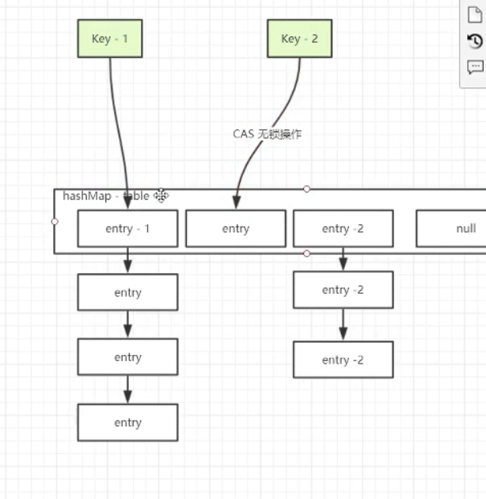

JDK 1.7
HashMap 链表 
JDK 1.8 
HashMap 链表(>=64红黑树)
链表长度超过(>)8但小于(<)64 链表进行resize操作
链表长度>=64 treeifyBin 链表转为红黑树

--> 如何resize? 如何treeifyBin?

JDK1.7

ConcurrentHashMap 
//
use segment 0 as prototype
// 或者叫分段锁
segment is lock,array in lock

 不同segment并行操作,相同segment同步操作

 segment不会扩容,默认就是这几个锁,锁不会增长.

JDK1.8

1.不使用segment作为lock
 而是Synchronized锁链表的头部,数组扩容,锁也就同时扩容.
 既线程安全又提供了更大的并发量.
 
2. 如果冲突的才会同步
  如果不冲突则是CAS无锁操作
  

