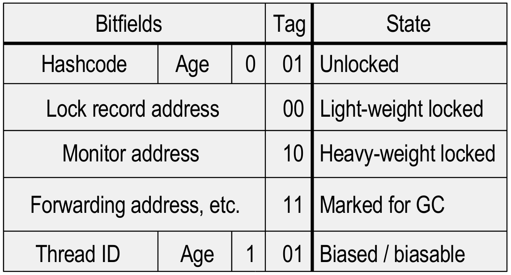
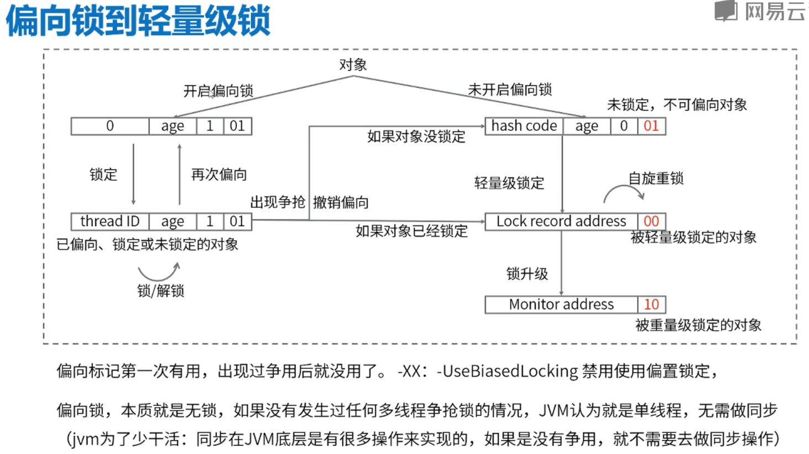
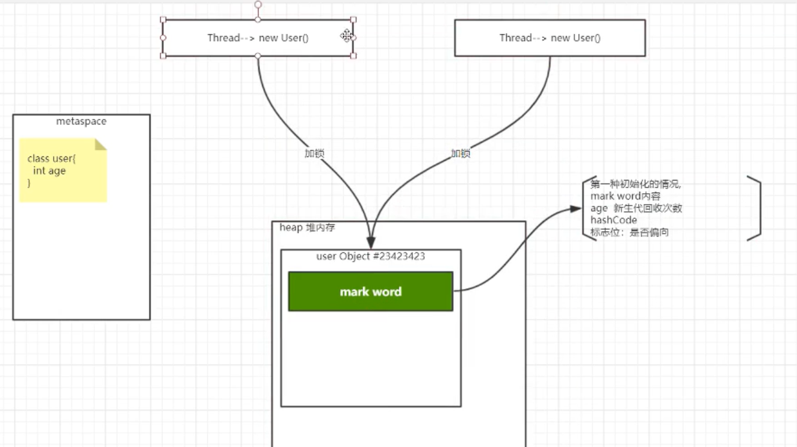
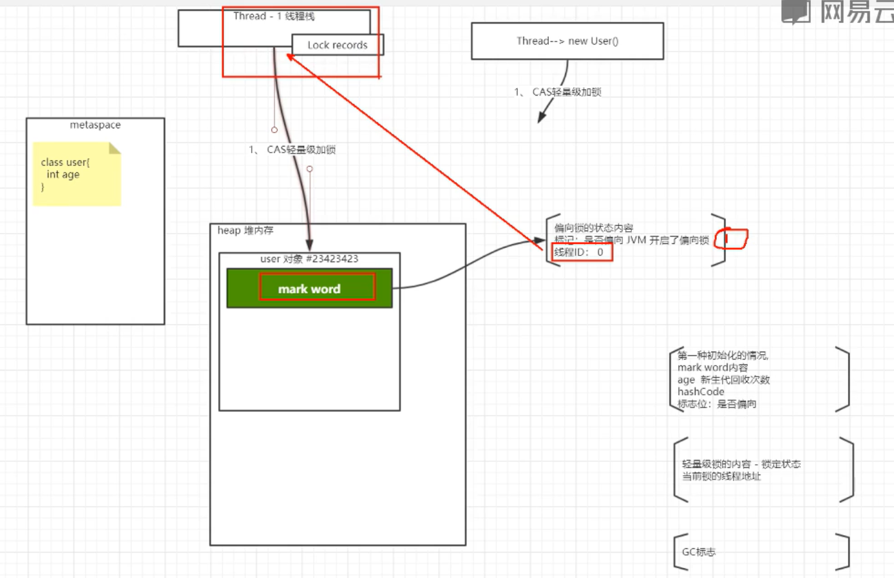
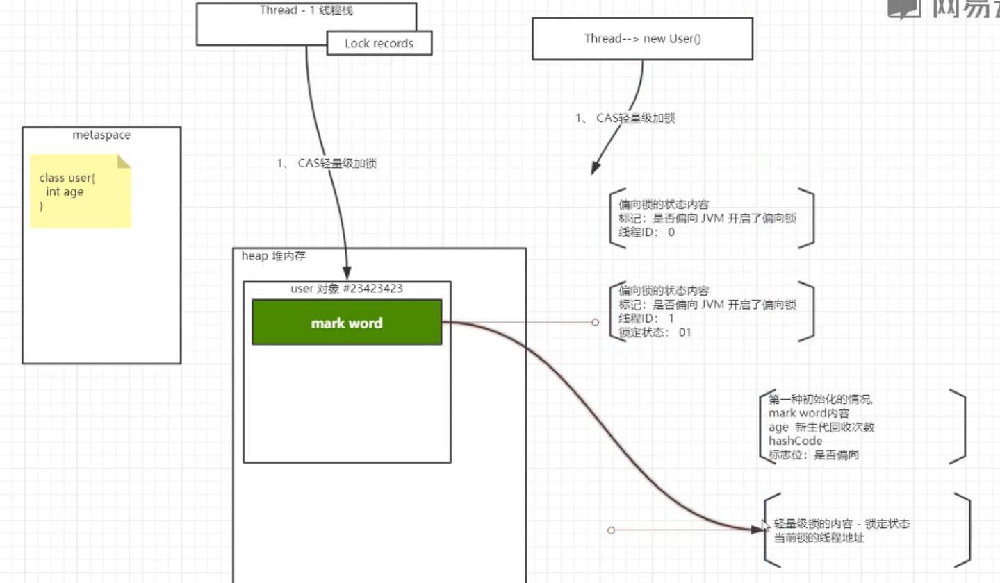
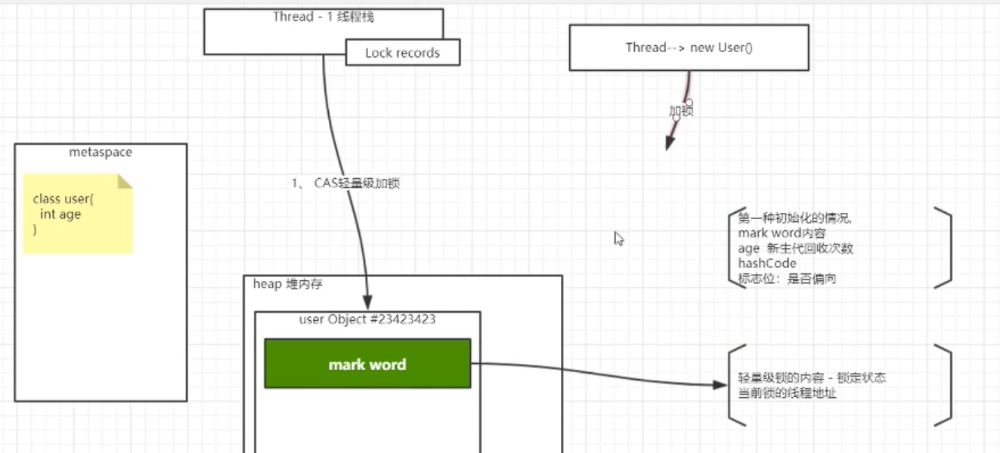
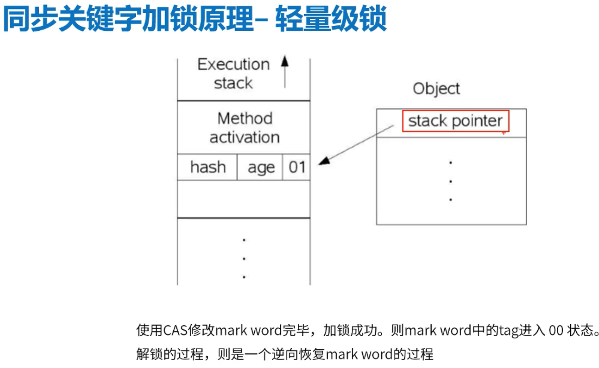

# 同步关键字加锁原理

 同步关键字就是去操作一个对象的内存，
 一个对象有一块内存，内存中有一些状态来标记它有没有加锁。

## Object Header
HotspotOverview Sun

| Mark Word |
|-----|
| Class Metadata Address |
| Array Length | 

 * Two words for ordinary objects
 * Three for arrays
 
 ## Mark Word
 在不同state下存放的数据是什么

## Lock & Object Headers Mark Word

## JMM Object Header Process cause of Lock

对象加锁-初始阶段-未开启偏向锁

对象加锁-初始阶段-开启偏向锁(默认是开启的)
后续只需判断线程ID是否相等。

JVM认为代码虽然加了锁，仍然可能只会有一个线程来访问，

并没有多线程并发的场景，

默认认为一个线程，那我就不做CAS操作，而是只做一次判断。

如果偏向锁一旦出现第二个或其他线程来争抢，则升级到轻量级锁。

对象锁-出现争抢-CAS轻量级加锁（直接改变对象头的信息）

当前线程拿到那些对象的锁，全部记录在线程栈的Lock records

对象锁-Monitor重量级锁

CAS自旋重锁可以设置一定次数，达到次数后就会升级成重量级锁，

重量级锁就是悲观锁，完全阻塞状态，

必须等待线程执行完成释放锁之后排序线程才能挨个执行。

 